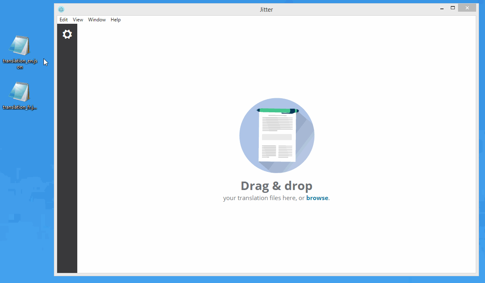

# Jitter
> Edit your language files in JSON format with ease!

[](LICENSE)
[](https://github.com/Microsoft/TypeScript/wiki/Coding-guidelines)
[](https://travis-ci.org/cyrilschumacher/Jitter)
[](https://codeclimate.com/github/cyrilschumacher/Jitter)
[](https://coveralls.io/github/cyrilschumacher/Jitter?branch=master)
[](https://david-dm.org/cyrilschumacher/Jitter)
[](https://david-dm.org/cyrilschumacher/Jitter#info=devDependencies)

Jitter is a tool for to edit your language files in JSON format:

* **Opens** your translation files,
* **visualizes and compares** side by side,
* **creates** or **delete** one or more categories or keys simply,
* and **saves** your results.



## Installation
```
npm install tsd -g

npm install
tsd install
gulp
```

## How to generate executables?
For generate executables (OS X, Windows, Linux), type the following commands in the terminal:

```
npm release
```

## Copyright

> The MIT License (MIT)
>
> Copyright (c) 2016 Cyril Schumacher
>
> Permission is hereby granted, free of charge, to any person obtaining a copy
> of this software and associated documentation files (the "Software"), to deal
> in the Software without restriction, including without limitation the rights
> to use, copy, modify, merge, publish, distribute, sublicense, and/or sell
> copies of the Software, and to permit persons to whom the Software is
> furnished to do so, subject to the following conditions:
>
> The above copyright notice and this permission notice shall be included in all
> copies or substantial portions of the Software.
>
> THE SOFTWARE IS PROVIDED "AS IS", WITHOUT WARRANTY OF ANY KIND, EXPRESS OR
> IMPLIED, INCLUDING BUT NOT LIMITED TO THE WARRANTIES OF MERCHANTABILITY,
> FITNESS FOR A PARTICULAR PURPOSE AND NONINFRINGEMENT. IN NO EVENT SHALL THE
> AUTHORS OR COPYRIGHT HOLDERS BE LIABLE FOR ANY CLAIM, DAMAGES OR OTHER
> LIABILITY, WHETHER IN AN ACTION OF CONTRACT, TORT OR OTHERWISE, ARISING FROM,
> OUT OF OR IN CONNECTION WITH THE SOFTWARE OR THE USE OR OTHER DEALINGS IN THE
> SOFTWARE.
